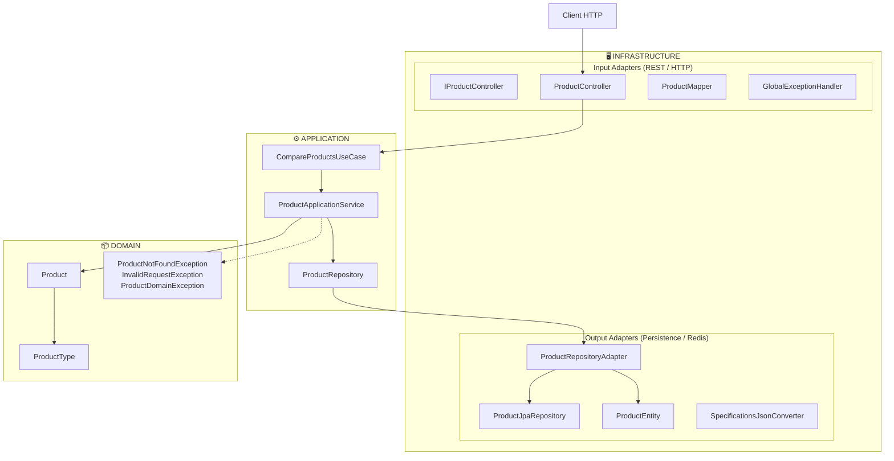

# Product Service

REST API backend for **product management and administration**. It provides catalog and product data operations—including product comparison with configurable fields—so clients can query, compare, and consume product information in a single, consistent API.

## Technology stack

| Technology         | Purpose                                  |
|--------------------|------------------------------------------|
| Java 21            | Language                                 |
| Spring Boot 3.5    | Framework                                |
| Spring Data JPA    | Persistence                              |
| H2                 | In-memory database                       |
| Flyway             | Database migrations                      |
| Redis              | Distributed cache (comparisons)          |
| Spring Cache       | Cache abstraction                        |
| Springdoc OpenAPI  | Swagger / OpenAPI 3 documentation       |
| Spring Boot Actuator | Health, metrics, info                 |
| Spring Cloud       | Configuration / ecosystem integration   |
| JaCoCo             | Code coverage (≥80% line/branch)        |

## API

### Goal

Provide an endpoint that returns details of **multiple products** in a single request, allowing the client to:

- Compare several items at once.
- Limit the response to **fields of interest** (name, price, specifications, etc.) via the optional `fields` parameter.

### Main endpoint

| Method | Path                                      | Description                                       |
|--------|-------------------------------------------|---------------------------------------------------|
| `GET`  | `/api/product-service/products/compare`   | Returns details of multiple products for comparison |

**Query parameters:**

- **`ids`** (required): Comma-separated product IDs. Example: `ids=1,2,3`.
- **`fields`** (optional): Comma-separated fields to include in the response. If omitted, all fields are returned.

**Allowed values for `fields`:**  
`id`, `name`, `description`, `price`, `size`, `weight`, `color`, `imageUrl`, `rating`, `productType`, `specifications`

**Examples:**

```bash
# Compare products 1 and 2 with all fields
curl "http://localhost:8080/api/product-service/products/compare?ids=1,2"

# Name, price and rating only
curl "http://localhost:8080/api/product-service/products/compare?ids=1,2&fields=name,price,rating"

# Focus on specifications
curl "http://localhost:8080/api/product-service/products/compare?ids=1,2&fields=name,price,specifications"
```

### Data model

- **Base product:** `id`, `name`, `description`, `price`, `size`, `weight`, `color`, `imageUrl`, `rating`, `productType`.
- **Specifications (dynamic):** the `specifications` field is a JSON object whose keys depend on the product type (e.g. smartphones: `batteryCapacityMah`, `cameraSpecs`, `memoryGb`, `storageGb`, `brand`, `modelVersion`, `operatingSystem`).

Example response:

```json
{
  "products": [
    {
      "id": 1,
      "name": "Smartphone Alpha X1",
      "description": "...",
      "price": 449.99,
      "imageUrl": "https://...",
      "rating": 4.5,
      "productType": "SMARTPHONE",
      "specifications": {
        "batteryCapacityMah": 5000,
        "cameraSpecs": "108MP main...",
        "memoryGb": 8,
        "storageGb": 128,
        "brand": "Alpha",
        "modelVersion": "X1",
        "operatingSystem": "Android 14"
      }
    }
  ]
}
```

### Error handling

Error responses follow a common structure:

- **422 Unprocessable Entity:** missing or invalid `ids` parameter, or non-numeric values.
- **404 Not Found:** one or more IDs do not exist. The body includes `details` and `validationErrors` with the missing IDs.
- **500 Internal Server Error:** unexpected error.

---

## Architecture

The service follows **Hexagonal Architecture** (Ports and Adapters): the domain is at the center and the application communicates with the outside world only through ports; infrastructure adapters implement those ports.

### Layers and responsibilities



**Flow:** The client calls the REST adapter → input port (use case) → application service → output port (repository) → persistence adapter → JPA/H2. The domain (`Product`, `ProductType`, exceptions) is used by the application and has no knowledge of infrastructure.

### Request flow

1. **Input (HTTP):** The request hits the REST adapter (`ProductController`), which implements the `IProductController` contract. The controller parses `ids` and `fields` and delegates to the use case.
2. **Use case:** `CompareProductsUseCase` (input port) is implemented by `ProductApplicationService`, which orchestrates the logic: validate IDs, fetch products in the requested order, and apply field filtering.
3. **Output (persistence):** The service uses the `ProductRepository` port (output port). The `ProductRepositoryAdapter` implements this port using `ProductJpaRepository` (Spring Data JPA) and maps `ProductEntity` ↔ domain `Product`. Specifications are persisted as JSON via `SpecificationsJsonConverter`.
4. **Cache:** Product reads may be cached in Redis (configured in `RedisConfiguration` and `application.yaml`), reducing load on the database.
5. **Response:** The controller maps domain `Product` instances to DTOs (`ProductResponse`, `ProductListResponse`) according to the requested `fields` and returns JSON.

### Design decisions

| Decision | Rationale |
|----------|-----------|
| Domain at the center | Business rules and model independent of frameworks and databases. |
| Ports (interfaces) | The application does not depend on HTTP or JPA details; adapters are interchangeable. |
| API contract in interface (`IProductController`) | API First: OpenAPI documentation and contract in one place; the controller only implements. |
| Specifications as JSON | Flexibility per product type (smartphones, laptops, etc.) without schema changes. |
| Redis cache | Better latency and lower load on H2 for repeated comparison scenarios. |
| Flyway + H2 | Versioned initial data and runnable environment without an external DB (development/demos). |

### Project structure (packages)

```
src/main/java/com/mercadolibre/
├── domain/
│   ├── model/                    # Domain entities and value objects (Product, ProductType)
│   └── exception/                # Domain exceptions
├── application/
│   ├── port/
│   │   ├── input/                # Use cases (CompareProductsUseCase, ProductField)
│   │   └── output/               # Repositories (ProductRepository)
│   └── service/                  # Application services (ProductApplicationService)
├── infrastructure/
│   ├── adapter/
│   │   ├── input/rest/           # Controller, contract, DTOs, mappers, error handling
│   │   └── output/persistence/  # JPA entity, repository, adapter, converters
│   └── config/                   # JPA, Redis, etc. configuration
└── ProductServiceApplication.java
```

---

## Setup and run

### Requirements

- **Java 21**
- **Maven 3.9+** (or the project's `./mvnw` wrapper)
- **Redis** (optional locally; if not present, cache can be disabled or a profile without Redis used, depending on configuration)

### Run locally

```bash
./mvnw spring-boot:run
```

The API is available at `http://localhost:8080`. Base path: `/api/product-service`.

### Docker

**Build image:**

```bash
docker build -t product-service:latest .
```

**Run with Docker Compose (service + Redis + Redis Commander):**

```bash
docker-compose up -d
```

Services:

- **API:** http://localhost:8080 (context path: `/api/product-service`)
- **Redis:** port 6379
- **Redis Commander:** http://localhost:8081 (UI to inspect Redis)

Environment variables for the service (in `docker-compose`): `REDIS_HOST`, `REDIS_PORT`. API health check: `GET /api/product-service/admin/health/liveness`.

### Interactive documentation (Swagger UI)

- **Swagger UI:** http://localhost:8080/api/product-service/swagger-ui.html  
- **OpenAPI JSON:** http://localhost:8080/api/product-service/v3/api-docs  

### Postman collection

A Postman collection is provided to call the API from [Postman](https://www.postman.com/):

| File | Description |
|------|--------------|
| [`postman collection/Mercado Libre.postman_collection.json`](postman%20collection/Mercado%20Libre.postman_collection.json) | Collection with the **Compare Products** request (configurable `ids` and `fields`) |

**How to use:**

1. Open Postman and go to **File → Import** (or drag and drop the JSON file).
2. Select `postman collection/Mercado Libre.postman_collection.json` from the project root.
3. Ensure the API is running at `http://localhost:8080` and run the **Compare Products** request.

The collection uses the base URL `http://localhost:8080/api/product-service`. Adjust the host/port in the request URL if your environment differs.

### H2 console (development only)

- URL: http://localhost:8080/api/product-service/h2-console  
- JDBC URL: `jdbc:h2:mem:productdb`  
- User: `sa`  
- Password: (empty)  

### Actuator (health and metrics)

- Base path: http://localhost:8080/api/product-service/admin  
- Health (liveness/readiness): `/admin/health`, with DB and Redis details.  
- Other endpoints exposed per `application.yaml`: `info`, `metrics`, `prometheus`, etc.

### Tests

```bash
./mvnw test
```

Includes:

- Unit tests for the application service and specifications converter.
- Controller integration tests (H2 + Flyway data).

Code coverage (JaCoCo) with line and branch thresholds ≥ 80%:

```bash
./mvnw verify
```
