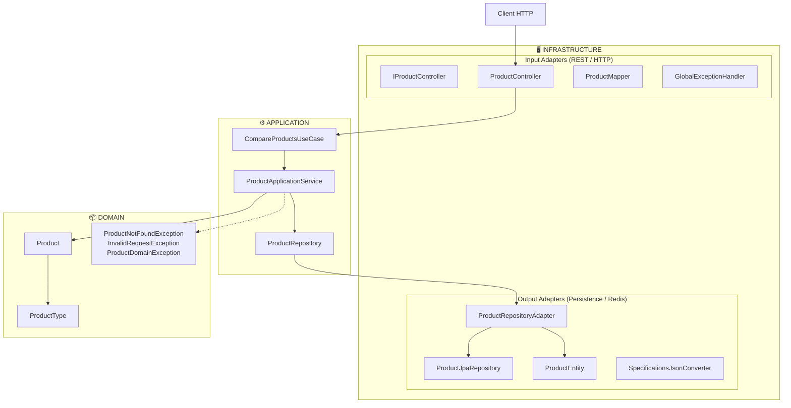
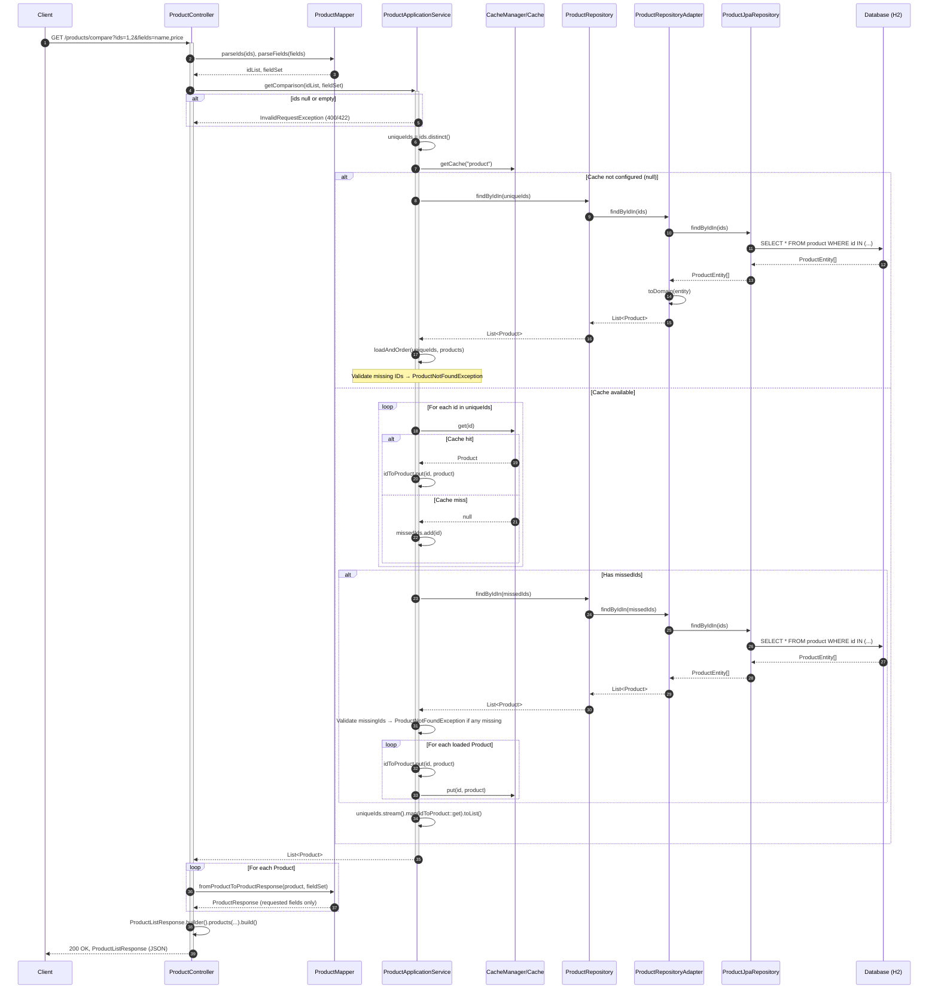

# Product Service Architecture

The service follows **Hexagonal Architecture** (Ports and Adapters): the domain is at the center and the application communicates with the outside world only through ports; infrastructure adapters implement those ports.

## Layers and responsibilities



**Flow:** The client calls the REST adapter → input port (use case) → application service → output port (repository) → persistence adapter → JPA/H2. The domain (`Product`, `ProductType`, exceptions) is used by the application and has no knowledge of infrastructure.

## Request flow

1. **Input (HTTP):** The request hits the REST adapter (`ProductController`), which implements the `IProductController` contract. The controller parses `ids` and `fields` and delegates to the use case.
2. **Use case:** `CompareProductsUseCase` (input port) is implemented by `ProductApplicationService`, which orchestrates the logic: validate IDs, fetch products in the requested order, and apply field filtering.
3. **Output (persistence):** The service uses the `ProductRepository` port (output port). The `ProductRepositoryAdapter` implements this port using `ProductJpaRepository` (Spring Data JPA) and maps `ProductEntity` ↔ domain `Product`. Specifications are persisted as JSON via `SpecificationsJsonConverter`.
4. **Cache:** Product reads may be cached in Redis (configured in `RedisConfiguration` and `application.yaml`), reducing load on the database.
5. **Response:** The controller maps domain `Product` instances to DTOs (`ProductResponse`, `ProductListResponse`) according to the requested `fields` and returns JSON.

## Product comparison flow (sequence diagram)



## Design decisions

| Decision | Rationale |
|----------|-----------|
| Domain at the center | Business rules and model independent of frameworks and databases. |
| Ports (interfaces) | The application does not depend on HTTP or JPA details; adapters are interchangeable. |
| API contract in interface (`IProductController`) | API First: OpenAPI documentation and contract in one place; the controller only implements. |
| Specifications as JSON | Flexibility per product type (smartphones, laptops, etc.) without schema changes. |
| Redis cache | Better latency and lower load on H2 for repeated comparison scenarios. |
| Flyway + H2 | Versioned initial data and runnable environment without an external DB (development/demos). |

## Project structure (packages)

```
src/main/java/com/mercadolibre/
├── domain/
│   ├── model/                    # Domain entities and value objects (Product, ProductType)
│   └── exception/                # Domain exceptions
├── application/
│   ├── port/
│   │   ├── input/                # Use cases (CompareProductsUseCase, ProductField)
│   │   └── output/               # Repositories (ProductRepository)
│   └── service/                  # Application services (ProductApplicationService)
├── infrastructure/
│   ├── adapter/
│   │   ├── input/rest/           # Controller, contract, DTOs, mappers, error handling
│   │   └── output/persistence/   # JPA entity, repository, adapter, converters
│   └── config/                   # JPA, Redis, etc. configuration
└── ProductServiceApplication.java
```
