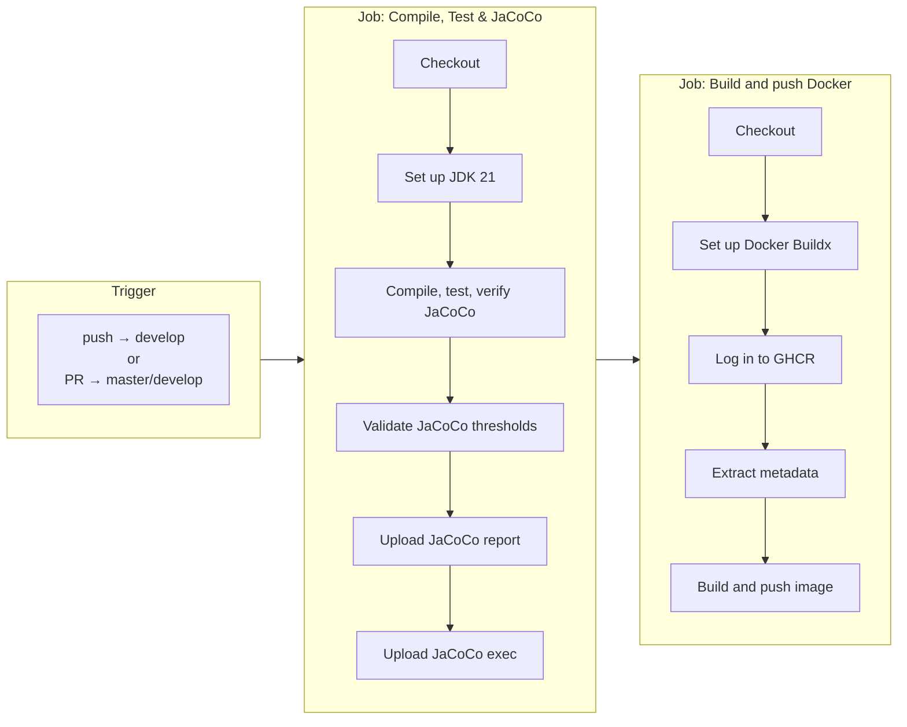
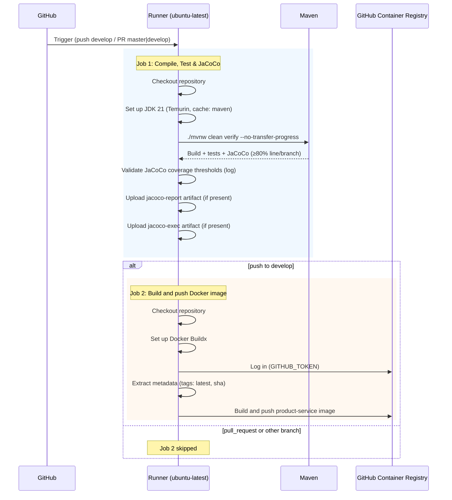

# CI Workflow

This document describes the **CI - Build, Test, JaCoCo & Docker** GitHub Actions workflow (`.github/workflows/ci.yml`): when it runs, which jobs and steps execute, and how they relate.

## Trigger

The workflow runs on:

| Event | Branches |
|-------|-----------|
| `push` | `develop` |
| `pull_request` | `master`, `develop` |

Only the **build-and-validate** job runs on every trigger. The **docker** job runs only on **push** to **develop** (not on pull requests).

## Pipeline overview

**Note:** Job 2 runs only when the event is `push` and the branch is `develop`; otherwise the pipeline ends after Job 1.

## Detailed flow (sequence)

## Job 1: Compile, Test & JaCoCo

| Step | Action | Description |
|------|--------|-------------|
| 1 | Checkout repository | `actions/checkout@v4` |
| 2 | Set up JDK 21 | `actions/setup-java@v4` — Java 21 (Temurin), Maven cache enabled |
| 3 | Compile, test and verify JaCoCo | `./mvnw clean verify --no-transfer-progress` with `MAVEN_OPTS: -Xmx1024m`. Fails if line or branch coverage &lt; 80%. |
| 4 | Validate JaCoCo coverage thresholds | Logs coverage info; report path `target/site/jacoco/` if present |
| 5 | Upload JaCoCo report | Uploads `target/site/jacoco/` as artifact `jacoco-report` (retention 7 days), `if: always()` |
| 6 | Upload JaCoCo execution data | Uploads `target/jacoco.exec` as artifact `jacoco-exec` (retention 7 days), `if: always()` |

**Result:** Build and tests must pass and coverage thresholds must be met. Artifacts are available in the run summary for debugging.

## Job 2: Build and push Docker image

**Condition:** `github.event_name == 'push' && github.ref == 'refs/heads/develop'`

| Step | Action | Description |
|------|--------|-------------|
| 1 | Checkout repository | `actions/checkout@v4` |
| 2 | Set up Docker Buildx | `docker/setup-buildx-action@v3` |
| 3 | Log in to GitHub Container Registry | `docker/login-action@v3` — registry `ghcr.io`, auth via `GITHUB_TOKEN` |
| 4 | Extract metadata for Docker | `docker/metadata-action@v5` — image `ghcr.io/<repo>/product-service`, tags: `latest` (on develop), plus SHA prefix |
| 5 | Build and push Docker image | `docker/build-push-action@v6` — build from repo root, push to GHCR, use GHA cache |

**Result:** Image is available at `ghcr.io/<OWNER>/<REPO>/product-service:latest` (and SHA-tagged) for pulls and deployments.

## Summary

| Item | Value |
|------|--------|
| Workflow file | `.github/workflows/ci.yml` |
| Runner | `ubuntu-latest` |
| Java | 21 (Eclipse Temurin) |
| Coverage enforcement | 80% line and branch (Maven JaCoCo in `verify`) |
| Docker registry | GitHub Container Registry (`ghcr.io`) |
| Docker image name | `ghcr.io/<repository>/product-service` |
| Docker tags on push to develop | `latest`, `<sha-prefix>` |
